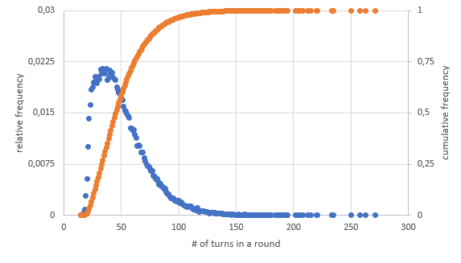

# goUno
A Go implementation of a popular card game: UNO

**Contributors are welcome**

## Motivation
This project was started with a variety of intentions:
- **Shuffling**: I wanted to analyze the [Riffle]([http://](https://en.wikipedia.org/wiki/Shuffling#Riffle)) technique for its randomness and its limits.
- **Strategies**: Is it advantageus to play aggressively / stay with a certain color / switch colors if possible? In order to analyse new strategies, one can implement more cases in `scoreCandidates(...)` in [player.go](goUno/player.go). 
- **Entertainment**: Just play UNO against a computer or together with other human players. 
- **Web readiness**: It will be rather straight forward to integrate the game engine as a server towards a web frontend that provides the game to users that wish for a more convenient UI than CLI.

## Usage
Clone the repository and build the binary:

```bash
git clone https://github.com/pfedan/goUno.git
cd goUno
go build
```

Run the game (using different parameters):
```bash
./goUno.exe # Default: Two players "A" and "B", non-human, 1 round
./goUno.exe -p Adam,Berta,Charles # Three players with custom names
./goUno.exe -p Human,Computer1,Computer2 -h 1,0,0 # Three players, one human player defined with the -h flag list
```

Analyze a large number of rounds (example):
 ```bash
# Command
./goUno.exe -m -r 100000 -p A,B,C,D # Muted game log (-m) and 100.000 rounds with four players: A, B, C and D

# Output:
Wins per Player: map[A:27035 B:24360 C:24192 D:24413]
Count of turns per game: map[15:1 16:2 17:30 18:91 19:281 20:533 21:1002 22:1419 23:1617 24:1844 25:1875 26:1952 27:2027 28:1967 29:1940 30:2034 31:1996 32:2131 33:2072 34:2145 35:2097 36:2072 37:2147 38:1981 39:2020 40:2123 41:2077 42:2088 43:2017 44:1991 45:1977 46:1880 47:1839 48:1793 49:1784 50:1740 51:1687 52:1591 53:1540 54:1524 55:1493 56:1450 57:1424 58:1280 59:1274 60:1236 61:1247 62:1182 63:1132 64:1018 65:1031 66:1018 67:928 68:926 69:925 70:842 71:796 72:745 73:728 74:707 75:689 76:653 77:652 78:575 79:566 80:528 81:529 82:497 83:448 84:463 85:422 86:411 87:391
88:389 89:343 90:326 91:309 92:281 93:255 94:256 95:253 96:225 97:211 98:205 99:217 100:210 101:180 102:190 103:170 104:159 105:143 106:132 107:127 108:128 109:128 110:117 111:128 112:94 113:87 114:97 115:79 116:111 117:72 118:51 119:64 120:68 121:66 122:59 123:51 124:54 125:48 126:44 127:30 128:42 129:42 130:41 131:27 132:43 133:25 134:29 135:28 136:23 137:28 138:28 139:15 140:19 141:17 142:19 143:19 144:15 145:15 146:9 147:15 148:15 149:8 150:9 151:8 152:13 153:6 154:7 155:3 156:7 157:7 158:11 159:5 160:3 161:5 162:4 163:3 164:6 165:4 166:3 167:2 168:6 169:7 170:3 171:3 172:8 173:2 174:5 175:6 176:4 177:2 178:2 179:1 180:1 181:1 184:2 185:1 186:2 187:1 188:2 189:1 191:2 192:1 194:2 195:2 202:1 204:1 205:1 208:1 212:1 215:1 220:1 221:1 233:1 235:2 250:1 258:1 263:1 271:1]
```

Plotting the above counts of turns per game as relative and cumulative frequencies will result in the following graph:
