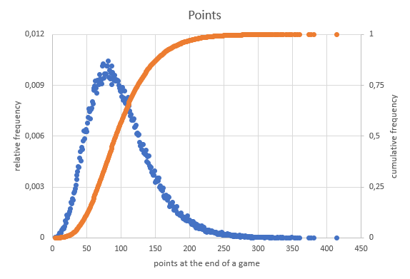
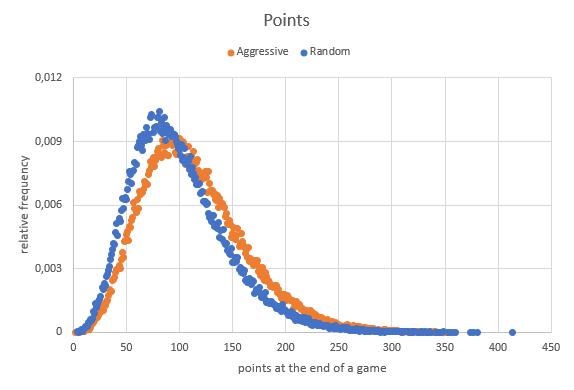

# goUno
A Go implementation of a popular card game: UNO

**Contributors are welcome**

## Motivation
This project was started with a variety of intentions:
- **Shuffling**: I wanted to analyze the [Riffle]([http://](https://en.wikipedia.org/wiki/Shuffling#Riffle)) technique for its randomness and its limits.
- **Strategies**: Is it advantageus to play aggressively / stay with a certain color / switch colors if possible? In order to analyse new strategies, one can implement more cases in `scoreCandidates(...)` in [player.go](goUno/player.go). 
- **Entertainment**: Just play UNO against a computer or together with other human players. 
- **Web readiness**: It will be rather straight forward to integrate the game engine as a server towards a web frontend that provides the game to users that wish for a more convenient UI than CLI.

## Usage
Clone the repository and build the binary:

```bash
git clone https://github.com/pfedan/goUno.git
cd goUno
go build
```

Run the game (using different parameters):
```bash
./goUno.exe # Default: Two players "A" and "B", non-human, 1 round
./goUno.exe -p Adam,Berta,Charles # Three players with custom names
./goUno.exe -p Human,Computer1,Computer2 -h 1,0,0 # Three players, one human player defined with the -h flag list
```

Analyze a large number of rounds (example):
 ```bash
# Command
./goUno.exe -m -r 100000 -p A,B,C,D # Muted game log (-m) and 100k rounds with four players: A, B, C and D

# Output:
Wins per Player: map[A:26931 B:24493 C:24110 D:24466]
Total points per Player: map[A:3126210 B:2783448 C:2743152 D:2777534]
Count of turns per game: map[15:1 16:3 17:32 18:108 19:283 20:560 21:917 22:1334 23:1602 24:1817 25:1982 26:1967 27:1969 28:1978 29:1866 30:1918 31:2009 32:2032 33:2119 34:2126 35:2068 36:2038 37:2032 38:2041 39:2135 40:2065 41:2023 42:2015 43:1970 44:1936 45:1987 46:1909 47:1857 48:1816 49:1767 50:1757 51:1708 52:1656 53:1627 54:1616 55:1497 56:1456 57:1406 58:1370 59:1364 60:1261 61:1224 62:1175 63:1074 64:1060 65:1020 66:992 67:930 68:945 69:832 70:810 71:810 72:772 73:743 74:672 75:651 76:646 77:652 78:600 79:531 80:574 81:481 82:483 83:481 84:488 85:389 86:413 87:373 88:360 89:354 90:343 91:316 92:283 93:271 94:274 95:256 96:241 97:245 98:232 99:210 100:202 101:211 102:186 103:155 104:178 105:152 106:117 107:158 108:136 109:114 110:112 111:121 112:109 113:101 114:77 115:92 116:87 117:80 118:76 119:61 120:77 121:61 122:65 123:61 124:58 125:44 126:49 127:56 128:43 129:41 130:48 131:35 132:38 133:39 134:35 135:27 136:27 137:29 138:27 139:25 140:28 141:17 142:20 143:22 144:16 145:11 146:18 147:9 148:17 149:13 150:10 151:9 152:4 153:5 154:12 155:7 156:10 157:12 158:8 159:6 160:7 161:6 162:5 163:7 164:6 165:5 166:2 167:8 168:8 169:4 170:1 171:3 172:2 173:2 174:1 176:5 177:2 178:2 179:3 180:3 181:3 182:3 183:3 184:1 185:3 186:1 187:1 188:3 189:3 192:1 193:1 194:2 195:1 196:1 197:1 199:1 201:1 207:1 209:2 210:1 212:1 220:1 222:1 231:2 232:1 233:1 234:1 235:2 241:1 244:1 251:1 331:1]
Count of points per game: map[4:2 5:2 6:4 7:5 8:3 9:6 10:10 11:7 12:17 13:28 14:18 15:21 16:34 17:32 18:38 19:40 20:54 21:49 22:66 23:71 24:75 25:84 26:96 27:105 28:120 29:112 30:129 31:152 32:155 33:173 34:179 35:191 36:188 37:240 38:239 39:236 40:229 41:301 42:303 43:298 44:344 45:344 46:392 47:416 48:413 49:416 50:400 51:417 52:436 53:512 54:466 55:475 56:506 57:521 58:557 59:577 60:560 61:592 62:594 63:636 64:633 65:651 66:694 67:676 68:663 69:670 70:731 71:728 72:781 73:766 74:734 75:838 76:769 77:802 78:822 79:796 80:840 81:842 82:872 83:849 84:866 85:816 86:876 87:818 88:902 89:883 90:841 91:80792:894 93:853 94:897 95:871 96:910 97:889 98:933 99:874 100:848 101:814 102:859 103:850 104:884 105:879 106:877 107:836 108:854 109:827 110:837 111:836 112:820 113:839 114:835 115:856 116:772 117:810 118:773 119:721 120:752 121:757 122:762 123:764 124:725 125:737 126:666 127:660 128:714 129:731 130:699 131:620 132:688 133:669 134:629 135:624 136:657 137:633 138:575 139:605 140:583 141:626 142:579 143:601 144:563 145:529 146:488 147:533 148:509 149:489 150:494 151:472 152:481 153:434 154:444 155:442 156:445 157:421 158:458 159:431 160:369 161:428 162:374 163:418 164:383 165:393 166:358 167:371 168:339 169:323 170:329 171:322 172:316 173:338 174:302 175:283 176:286 177:319 178:298 179:260 180:263 181:251 182:260 183:226 184:218 185:238 186:221 187:245 188:233 189:230 190:198 191:217 192:208 193:192 194:204 195:181 196:185 197:172 198:175 199:182 200:156 201:150 202:183 203:170 204:139 205:140 206:151 207:133 208:138 209:129 210:137 211:129 212:105 213:112 214:104 215:133 216:108 217:113 218:104 219:102 220:98 221:88 222:92 223:88 224:98 225:98 226:90 227:90 228:93 229:66 230:77 231:54 232:61 233:72 234:63 235:67 236:70 237:51 238:49 239:60 240:51 241:52 242:53 243:57 244:50 245:51 246:50 247:41 248:44 249:38 250:47 251:26 252:26 253:31 254:32 255:36 256:29 257:33 258:37 259:22 260:30 261:20 262:37 263:22 264:26 265:19 266:23 267:25 268:34 269:22 270:19 271:21 272:22 273:13 274:17 275:13 276:18 277:15 278:21 279:15 280:17 281:16 282:11 283:14 284:15 285:7 286:13 287:5 288:18 289:5 290:12 291:8 292:11 293:10 294:5 295:8 296:6 297:7 298:7 299:8 300:8 301:9 302:8 303:9 304:3 305:7 306:10 307:6 308:7 309:7 310:4 311:5 312:4 313:3 314:3 315:7 316:6 317:4 318:3 319:2 320:5 321:1 322:1 323:3 324:2 325:2 326:2 327:4 328:2 329:2 330:5 331:1 332:1 333:5 334:3 335:3 336:3 337:1 338:1 340:2 341:2 342:2 343:2 344:3 345:1 346:1 347:1 351:1 352:2 353:2 355:2 357:1 359:1 360:1 362:2 363:1 366:1 369:1 371:1 378:1 379:1 383:1 387:1 389:1 393:1 400:1 416:1 424:1]
```

Plotting the above counts of turns per game as relative and cumulative frequencies will result in the following graphs:




For instance you can see, that if everyone plays aggressively, the winner gets more points at the end of a round:
