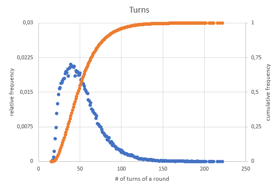

# goUno
A Go implementation of a popular card game: UNO

**Contributors are welcome**

## Motivation
This project was started with a variety of intentions:
- **Shuffling**: I wanted to analyze the [Riffle]([http://](https://en.wikipedia.org/wiki/Shuffling#Riffle)) technique for its randomness and its limits.
- **Strategies**: Is it advantageus to play aggressively / stay with a certain color / switch colors if possible? In order to analyse new strategies, one can implement more cases in `scoreCandidates(...)` in [player.go](goUno/player.go). 
- **Entertainment**: Just play UNO against a computer or together with other human players. 
- **Web readiness**: It will be rather straight forward to integrate the game engine as a server towards a web frontend that provides the game to users that wish for a more convenient UI than CLI.

## Usage
Clone the repository and build the binary:

```bash
git clone https://github.com/pfedan/goUno.git
cd goUno
go build
```

Run the game (using different parameters):
```bash
./goUno.exe # Default: Two players "A" and "B", non-human, 1 round
./goUno.exe -p Adam,Berta,Charles # Three players with custom names
./goUno.exe -p Human,Computer1,Computer2 -h 1,0,0 # Three players, one human player defined with the -h flag list
```

Analyze a large number of rounds (example):
 ```bash
# Command
./goUno.exe -m -r 100000 -p A,B,C,D # Muted game log (-m) and 100.000 rounds with four players: A, B, C and D

# Output:
Wins per Player: map[A:27063 B:24300 C:24333 D:24304]
Total points per Player: map[A:3145587 B:2738713 C:2763046 D:2745681]
Count of turns per game: map[16:3 17:23 18:92 19:256 20:563 21:956 22:1321 23:1684 24:1871 25:1931 26:1915 27:1977 28:1978 29:1922 30:1997 31:2027 32:2024 33:2108 34:2086 35:2136 36:2155 37:2084 38:2156 39:2030 40:2028 41:2088 42:2000 43:2016 44:1921 45:1969 46:1987 47:1816 48:1797 49:1836 50:1742 51:1712 52:1595 53:1585 54:1564 55:1466 56:1455 57:1372 58:1369 59:1301 60:1246 61:1163 62:1120 63:1185 64:1060 65:1101 66:981 67:992 68:960 69:858 70:842 71:792 72:750 73:780 74:717 75:649 76:620 77:547 78:621 79:549 80:539 81:508 82:515 83:429 84:401 85:398 86:390 87:417 88:399 89:368 90:333 91:304 92:304 93:276 94:229 95:244 96:252 97:211 98:232 99:200 100:206 101:169 102:189 103:139 104:174 105:152 106:140 107:130 108:115 109:120 110:105 111:108 112:93 113:103 114:96 115:93 116:74 117:76 118:88 119:67 120:63 121:72 122:58 123:57 124:47 125:58 126:43 127:37 128:43 129:37 130:28 131:34 132:44 133:29 134:32 135:26 136:20 137:23 138:34 139:18 140:18 141:24 142:25 143:10 144:22 145:13 146:14 147:15 148:11 149:13 150:12 151:15 152:4 153:5 154:5 155:10 156:5 157:8 158:1 159:6 160:10 161:6 162:4 163:8 164:8 165:10 166:5 167:4 168:2 169:2 170:6 171:3 172:5 173:2 174:2 175:1 176:2 177:1 178:5 180:2 181:3 182:4 183:1 184:1 187:1 188:2 189:3 190:4 191:2 195:1 196:1 197:1 198:1 199:1 200:1 201:1 210:1 211:2 213:1 220:1 222:1 230:1 233:1 237:1 246:1 248:1 254:1]
```

Plotting the above counts of turns per game as relative and cumulative frequencies will result in the following graph:
